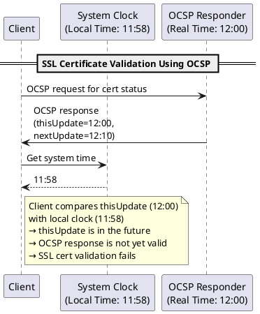

## Basics

#### What is a TLS session?

A session is created when a **TLS handshake** is established. This allows the client and server to have a unique set of encryption keys that are derived during the handhshake, known as **session keys**. Even if somoneone were to intercept the
the traffic the session keys will not be able to decrypt other sessions. This is known **Perfect Forward Secrecy (PFS)** because each session is independent. 

A session is established when:
  - Initial connection to website 
  - Session resumption - Returning to the website may resume an existing session 
  
Scenarios that can trigger a new session:

  - New browser tab
  - Determined by server configuration 
  - Subdomains

## Establishing a TLS session

```
@startuml
title TLS Handshake with Algorithms

actor Client
actor Server
participant "CA" as CertificateAuthority

== Step 1: Client Hello ==
Client -> Server: ClientHello (Cipher suites, Key Exchange Algorithm)
note right of Client
Client proposes algorithms for:
- Key Exchange Algorithm (e.g., ECDHE, RSA)
- Encryption Algorithm (e.g., AES)
- Hashing Algorithm (e.g., SHA-256)
end note

== Step 2: Server Hello ==
Server -> Client: ServerHello (Chosen Cipher Suite, Key Exchange Algorithm)
note right of Server
Server selects the cipher suite including:
- Key Exchange Algorithm (e.g., ECDHE)
- Encryption Algorithm (e.g., AES)
- Hashing Algorithm (e.g., SHA-256)
end note

== Step 3: Server Certificate ==
Server -> Client: Certificate (Signed by CA)
note right of Client
Client verifies the certificate using the CA's public key:
- Authentication Algorithm (e.g., RSA, ECDSA)
end note

== Step 4: Server Key Exchange ==
Server -> Client: ServerKeyExchange (Ephemeral Public Key)
note right of Server
Ephemeral key is used for:
- Key Exchange Algorithm (e.g., ECDHE)
end note

== Step 5: Client Key Exchange ==
Client -> Server: ClientKeyExchange (Pre-master secret encrypted)
note right of Client
Pre-master secret is encrypted using:
- Authentication Algorithm (e.g., RSA, ECDSA)
end note

== Step 6: Generate Session Keys ==
Client -> Client: Generate session keys using key material and Hashing Algorithm (e.g., SHA-256)
Server -> Server: Generate session keys using key material and Hashing Algorithm (e.g., SHA-256)

== Step 7: Finished Messages ==
Client -> Server: Finished message (MAC using Hashing Algorithm)
Server -> Client: Finished message (MAC using Hashing Algorithm)

== Step 8: Secure Communication ==
Client <--> Server: Encrypted data transfer using Encryption Algorithm (e.g., AES)
@enduml
```  


## What is OCSP (Online Certificate Status Protocol) and why should I care?

- Think of it as an API for checking revocation.

- The client sends the cert’s serial number to an OCSP responder (usually the CA), asking:

> “Is this certificate still valid?”

- The responder sends back a signed response saying: `good`, `revoked`, or `unknown`.


**OCSP responses include:**

`thisUpdate`: when the status was generated.

`nextUpdate`: when the response expires.

This is to ensure the client is not dealing with a stale response.


#### Time Sync Issue

A certificate handshake can fail due to time synchronoisation issues that is likely to be caused by OSCP check. In this case it is confirmed that the certificate expiry and system time is well within the `NotBefore` and `NotAfter` time. 

```
# How you would check this
openssl s_client -connect your-peer:443 </dev/null 2>/dev/null | openssl x509 -noout -startdate -enddate
```

An example error you might see in your client logs:

```
failed to verify certificate: x509: certificate has expired or is not yet valid: current time 2025-06-04T23:43:47Z is before 2025-06-04T23:43:59Z\"
```




## Commands

##### Supported ciphers by server

```
 nmap --script ssl-enum-ciphers -p 443 $HOST
```

#### Specify cipher

<sub> Note: Ciphers can be discovered via `nmap` command above. </sub>

```
# TLS v1.2 
openssl s_client -connect $HOST:443 -no_tls1_3 -cipher TLS_ECDHE_RSA_WITH_AES_256_GCM_SHA384

# TLS v1.3
openssl s_client -connect $HOST:443 -tls1_3 -ciphersuites TLS_AES_256_GCM_SHA384
```


## References 

- https://www.cloudflare.com/learning/ssl/what-happens-in-a-tls-handshake/
- https://www.youtube.com/watch?v=C4Gtq5anlyc&ab_channel=ChrisGreer